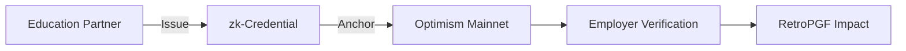
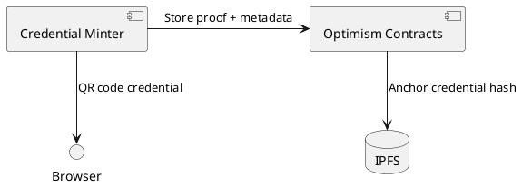

# kctiDAO: Verifiable Credentials for Cybersecurity Workforce
> Optimism RetroPGF Round 4 Application
## 1. Project Overview
kctiDAO tackles the global cybersecurity workforce crisis (3.4M+ unfilled positions) by building open-source, Optimism-anchored verifiable credentials. Our solution enables:
- **10x faster hiring** through zk-proof credential verification
- **DAO-curated talent pipelines** for web3 projects
- **Public goods infrastructure** for trustless skill attestations

## 2. Why Optimism?
| Metric | Ethereum L1 | Optimism L2 |
|--------|-------------|-------------|
| Cost/Credential | $5.20 | $0.003 |
| Verification Time | 3-5 min | <15 sec |
| Ecosystem Fit | Low | Native (AttestationStation) |
**Alignment with RetroPGF**:
- 🛠️ Foundational credential primitive for Superchain
- 👥 Talent verification for public goods projects
- 📚 Open-source under MIT license
## 3. Technical Implementation
### Core Components
| Component | Technology | Status |
|-----------|------------|--------|
| Credential Schema | W3C VC Standard | Designed |
| zk-SNARK Circuits | circom, snarkjs | In development |
| Optimism Contracts | Solidity, Hardhat | Testnet ready |
| Frontend | React, Vite | MVP complete |
### Optimism Integration

## 4. Grant Request
**Amount**: $30,000 USDC  
**Breakdown**:
- $18,000: Core credential development (12 weeks)
- $7,000: zk-SNARK circuit optimization
- $5,000: Smart contract audit
## 5. Team
**Lead Developer**: Louis Pearson  
- 5+ years full-stack development
- Specialized in zk-proof systems
- Passion for cybersecurity workforce solutions
**Advisors**: Seeking Optimism ecosystem advisors (open call)
---
> [View live demo](https://is still under development) | [GitHub Repo](https://github.com/bmx4life77/kctiDAO-credentials)
