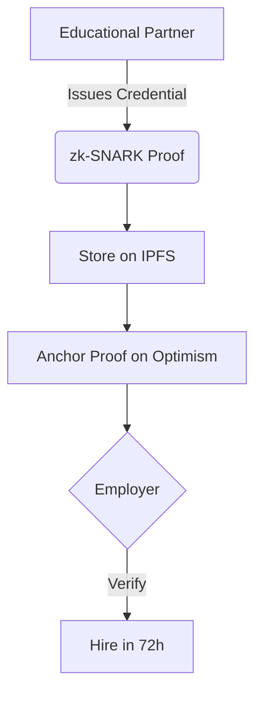

```markdown
# kctiDAO Litepaper: Verifiable Credentials for Cybersecurity Workforce
## 1. The Global Cybersecurity Crisis
- 3.4M+ unfilled positions worldwide ([ISC² 2023](https://www.isc2.org/))
- 87% of organizations report critical skills gaps
- Average hiring cycle: 45 days due to manual verification
## 2. Our Solution: Optimism-Powered Credentials

### Core Components
| **Technology** | **Role** | **Benefit** |
|----------------|----------|-------------|
| zk-SNARKs | Privacy-preserving verification | Zero-knowledge proof of credentials |
| IPFS + W3UP | Decentralized storage | Tamper-proof, permanent records |
| Optimism L2 | Transaction anchoring | $0.003 per credential (vs. L1 $5.20) |
| MongoDB | GDPR-compliant metadata | Soft-delete, encryption, access control |
## 3. Why Optimism?
- **Cost Efficiency**: 99.9% reduction in credential costs
- **Scalability**: 2,000+ TPS for enterprise adoption
- **Ecosystem Alignment**: 
  - Public goods funding eligibility
  - AttestationStation integration potential
  - Superchain interoperability
## 4. Impact Projections (Year 1)

## 5. Roadmap
- **Q3 2025**: Optimism Goerli testnet deployment
- **Q4 2025**: Mainnet launch + first educational partner
- **Q1 2026**: Cross-chain credential portability
---
> “kctiDAO turns the cybersecurity talent shortage into an Optimism-powered opportunity.”  
```
